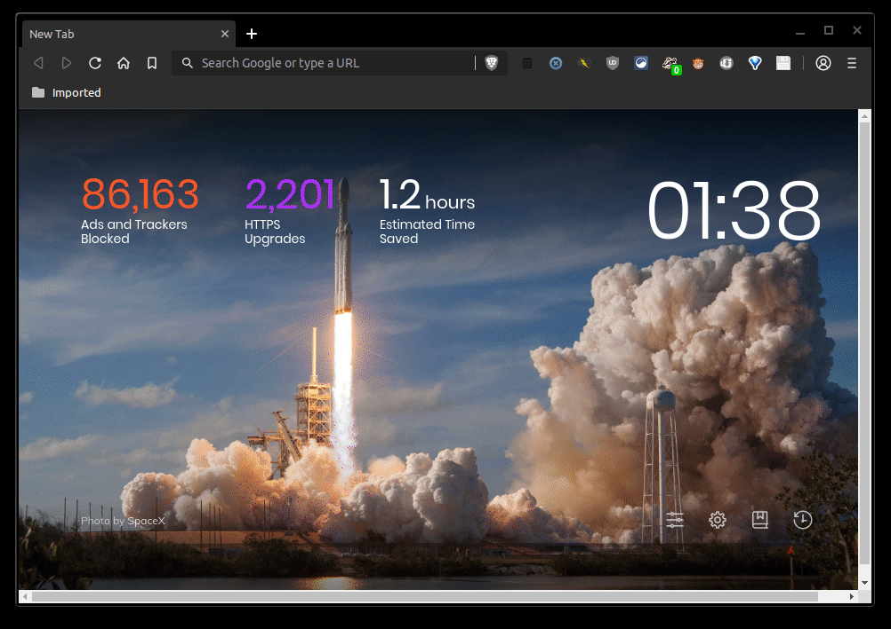

# Cherwell Coding Question - Geometric Layouts

## Description

A C# web API endpoint that calculates triangle coordinates when given a row (A-F) and column (1-12) and calculates the row and column when given vertex coordinates.

## Features

The following functionality is complete:

* [x] Implement a C# web API endpoint using .NET Core 2.2
* [x] Calculate triangle coordinates when given a row and column
* [x] Calculate triangle row and column when given valid vertex coordinates
* [x] Return 404 status code for "Not Found" instead of null object
* [x] Return JSON object for all responses

## Demo

## Example URLs

https://localhost:5001/api/tri

https://localhost:5001/api/tri/a5

https://localhost:5001/api/tri/F3

https://localhost:5001/api/tri/a13

https://localhost:5001/api/tri/g5

https://localhost:5001/api/tri/F3

https://localhost:5001/api/tri/0-10-0-0-10-10

https://localhost:5001/api/tri/20-30-20-20-30-30

https://localhost:5001/api/tri/30-40-30-50-20-40

https://localhost:5001/api/tri/61-61-61-61-61-61

https://localhost:5001/api/tri/a-1-2-c-3-d

## Technical Discussion

See the [TECHNICAL DISCUSSION](TECHNICAL_DISCUSSION.md) for more details on the design and implementation of this

## Credits

Peter Akala

## License

See the [LICENSE](LICENSE.md) file for license rights and limitations (Apache License 2.0).
